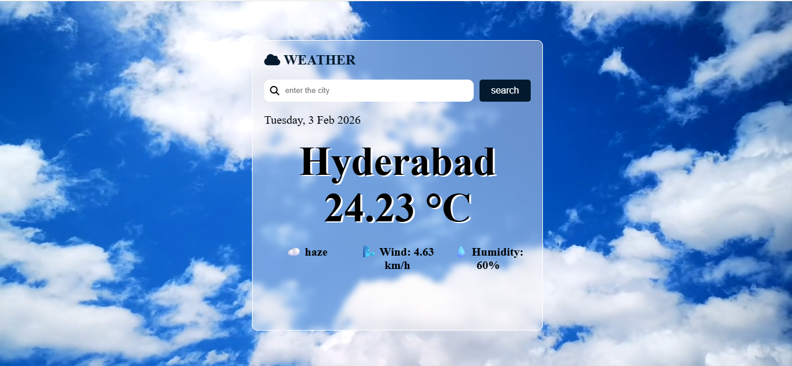

# 🌤️ Weather App

A simple and responsive Weather Application built using **HTML**, **SCSS**, and **JavaScript** that allows users to check real-time weather information for any location using a **Live Weather API**.

This app helps users to know:
- Current temperature
- Weather condition (Clear, Cloudy, Rain, etc.)
- Humidity
- Wind speed
- Location name
## View live
```
https://gabhishek-weather-app.netlify.app/
```
---
## 📸 Screenshot


---
## 🚀 Features

- 🔍 Search weather by city name  
- 🌎 Get real-time weather data using Live API  
- 📱 Fully responsive design  
- 🎨 Clean and modern UI using SCSS  
- ⚡ Fast and lightweight  
- 🔄 Dynamic UI updates based on API response  

---

## 🛠️ Technologies Used

- **HTML** – Structure of the app  
- **SCSS** – Styling and UI design  
- **JavaScript** – API integration and logic  
- **Weather API** – Fetching live weather data  

---

## 📂 Project Structure
```
weather-app/
│
├── index.html
├── css/
│ └── style.css
├── scss/
│ └── style.scss
├── script.js
│ 
└── README.md
```


---

## 🔑 API Setup

1. Create an account on any Weather API provider (e.g., OpenWeatherMap).
2. Get your API Key.
3. Add your API key in `script.js`:

```js
const API_KEY = "YOUR_API_KEY_HERE";
```

## ⚙️ How to Run the Project

1. Clone the repository  
```bash
git clone https://github.com/abhishekgorinta/weather-app.git
```

2. Open index.html in your browser
   OR use Live Server in VS Code.

## 👨‍💻 Author:

Developed by Abhishek Gorinta


## License:

This project is free to use and modify for learning purposes.

⭐ If you like this project, don't forget to give it a star on GitHub!
